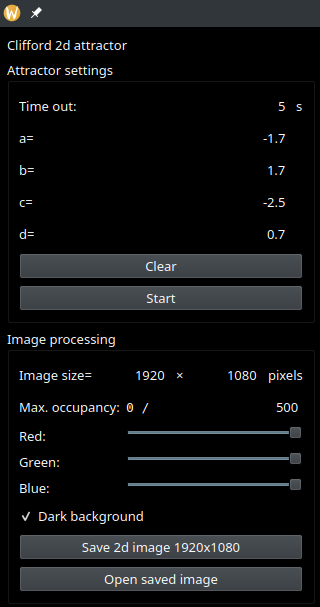

# Clifford2d
Clifford attractor

An implementation of the Clifford attractor using the Qt libraries

# Description
## The Clifford attractor

# Usage

- Time out: this defines how long the attractor will run

- a, b c, d: the parameters of the Clifford attractor

  Suggested sets: 
    a=-1.70, b= 1.70, c=-2.5,  d= 0.7 
    a=-1.70, b= 1.80, c=-1.90, d= 0.4 
    a= 0.70, b= 1.30, c=-1.40, d= 1.15 
    a= 2.70, b=-1.15, c= 1.75, d= 0.75 
    a= 1.45, b=-1.35, c= 2.30, d= 1.10 
    a= 1.77, b= 1.70, c= 1.20, d= 0.67 
    a=-1.40, b= 1.60, c= 1.00, d= 0.70 
    a=-1.40, b= 1.60, c= 2.00, d=-0.67 
    a=-2.00, b=-1.33, c= 0.95, d= 0.45 

- Clear: Remove the occupancy history. Typically used when starting the attractor with a new set of parameters.

- Start/Continue: run the attractor.

- Image size: Defines the occupancy matrix and the underlying default size of the image.

- Max. occupancy: The ceiling value for occupancy. This is used to limit the difference bewtween max. and min. (0) occupancies so as to limit the squashing of colors.

- Save: save the picture to the user's default 'Pictures' or 'Images' directory defined in the OS.

# Compilation
## Linux
- Use your distribution's pacakge manager to  install the Qt6***.dev libraries

## Windows and Mac
- Install the Qt6 development libraries from the Qt site
- Compile in release mode
